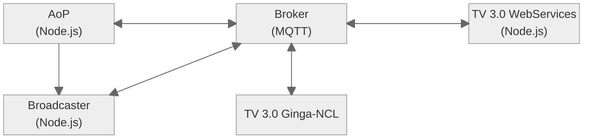

# TV 3.0 AoP Experimentation

    

The **TV 3.0 AoP Experimentation** project provides an environment for experimenting with TV 3.0 AoP services. The environment is designed to be extensible such that developers can easily create/extend its functionalities.

# Features

* Distributed implementation of TV 3.0 components in a microservices fashion
* MQTT-based communication between services
* Full Docker deployment (Redis + KrakenD + Mosquitto plugin)
* User state persisted in Redis (`session:current-user`, `users:index`, broadcaster-attrs)

# Architecture



# Dependencies

* Docker + Compose plugin (Linux nativo, ou WSL2 mirrored em Windows)
* Git com suporte a submodules

# Execution

```bash
# Clone com submodules
git clone --recurse-submodules https://github.com/multisens/TV30.git
cd TV30

# Copia o template do .env (versionado) — ele ativa os profiles "linux"
# e "mqtt", sem os quais aop/ccws/bcast/mosquitto nao sobem.
cp .env.example .env

# Sobe a stack inteira (Linux full-container)
docker compose up -d
```

Em Windows + WSL2 com porta 9001 ocupada no host, edite `.env` na raiz: `MQTT_WS_PORT=9003`.

Pra detalhes (portas, env vars, padrão arquitetural dos módulos broadcaster, troubleshooting WSL), ver [`ARCHITECTURE.md`](./ARCHITECTURE.md).
