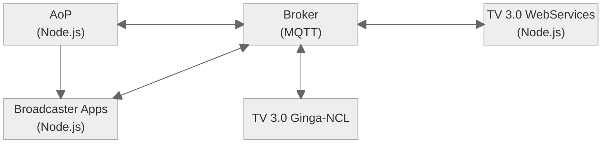

# TV 3.0 AoP Experimentation

  

The **TV 3.0 AoP Experimentation** project provides an evironment for experimenting with TV 3.0 AoP services. The environment is designed to be extensible such that developers can easily create/extend its functionalities.


# Features

* Distributed implementation of TV 3.0 components in a microservices fashion
* MQTT-based


# Architecture



# Dependencies

* Mosquitto MQTT Broker
* Node JS
* [PM2](https://pm2.keymetrics.io)
* [NW.js](https://nwjs.io)
* [FFmpeg](https://ffmpeg.org)


# Execution

Components managed by PM2.
```$ pm2 start ecosystem.config.js```