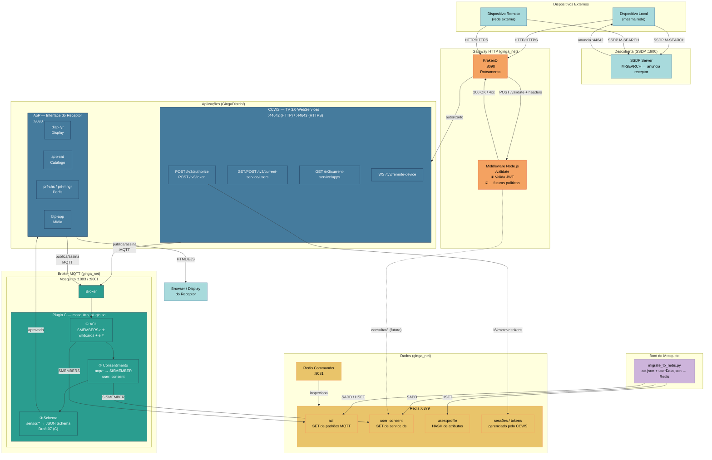

# Diagrama Unificado — GingaDistrib

Visão completa do sistema: dispositivos, serviços, segurança, mensageria e dados.

```mermaid
graph TB
    %% ── Externos ──────────────────────────────────────────────────────────────
    subgraph EXT["Dispositivos Externos"]
        DEV_LOCAL["Dispositivo Local\n(mesma rede)"]
        DEV_REMOTE["Dispositivo Remoto\n(rede externa)"]
    end

    %% ── Descoberta ────────────────────────────────────────────────────────────
    subgraph DISC["Descoberta (SSDP :1900)"]
        SSDP["SSDP Server\nM-SEARCH → anuncia receptor"]
    end

    %% ── Gateway HTTP ──────────────────────────────────────────────────────────
    subgraph GW["Gateway HTTP (ginga_net)"]
        KD["KrakenD\n:8090\nRoteamento"]
        MW["Middleware Node.js\n/validate\n① Valida JWT\n② ... futuras políticas"]
    end

    %% ── Aplicações ────────────────────────────────────────────────────────────
    subgraph APPS["Aplicações (GingaDistrib/)"]
        subgraph CCWS_BOX["CCWS — TV 3.0 WebServices\n:44642 (HTTP) / :44643 (HTTPS)"]
            AUTH_API["POST /tv3/authorize\nPOST /tv3/token"]
            USER_API["GET/POST /tv3/current-service/users"]
            APP_API["GET /tv3/current-service/apps"]
            DEV_API["WS /tv3/remote-device"]
        end

        subgraph AOP_BOX["AoP — Interface do Receptor\n:8080"]
            DISP["disp-lyr\nDisplay"]
            CAT["app-cat\nCatálogo"]
            PRF["prf-chs / prf-mngr\nPerfis"]
            BTP["btp-app\nMídia"]
        end
    end

    %% ── MQTT ──────────────────────────────────────────────────────────────────
    subgraph MQTT_BOX["Broker MQTT (ginga_net)"]
        subgraph MQ_SVC["Mosquitto :1883 / :9001"]
            MQ["Broker"]
            subgraph PLUGIN["Plugin C — mosquitto_plugin.so"]
                P_ACL["① ACL\nSMEMBERS acl:<user_id>\nwildcards + e #"]
                P_CON["② Consentimento\naop/* → SISMEMBER\nuser:<id>:consent <serviceId>"]
                P_SCH["③ Schema\nsensor/* → JSON Schema\nDraft-07 (C)"]
            end
        end
    end

    %% ── Dados ─────────────────────────────────────────────────────────────────
    subgraph DATA["Dados (ginga_net)"]
        subgraph REDIS_BOX["Redis :6379"]
            R_ACL["acl:<user_id>\nSET de padrões MQTT"]
            R_CON["user:<user_id>:consent\nSET de serviceIds"]
            R_PRF["user:<user_id>:profile\nHASH de atributos"]
            R_SES["sessões / tokens\ngerenciado pelo CCWS"]
        end
        REDIS_UI["Redis Commander\n:8081"]
    end

    %% ── Boot ──────────────────────────────────────────────────────────────────
    subgraph BOOT["Boot do Mosquitto"]
        PY["migrate_to_redis.py\nacl.json + userData.json → Redis"]
    end

    %% ── Display ───────────────────────────────────────────────────────────────
    BROWSER["Browser / Display\ndo Receptor"]

    %% ── Fluxo HTTP ────────────────────────────────────────────────────────────
    DEV_LOCAL  -->|"SSDP M-SEARCH"| SSDP
    DEV_REMOTE -->|"SSDP M-SEARCH"| SSDP
    SSDP       -->|"anuncia :44642"| DEV_LOCAL

    DEV_LOCAL  -->|"HTTP/HTTPS"| KD
    DEV_REMOTE -->|"HTTP/HTTPS"| KD
    KD         -->|"POST /validate + headers"| MW
    MW         -->|"200 OK / 4xx"| KD
    KD         -->|"autorizado"| CCWS_BOX

    %% ── Autenticação ──────────────────────────────────────────────────────────
    AUTH_API   -->|"lê/escreve tokens"| R_SES

    %% ── CCWS → MQTT ───────────────────────────────────────────────────────────
    CCWS_BOX   -->|"publica/assina\nMQTT"| MQ

    %% ── AoP → MQTT ────────────────────────────────────────────────────────────
    AOP_BOX    -->|"publica/assina\nMQTT"| MQ

    %% ── Pipeline do Plugin ────────────────────────────────────────────────────
    MQ         --> P_ACL --> P_CON --> P_SCH
    P_ACL      -->|"SMEMBERS"| R_ACL
    P_CON      -->|"SISMEMBER"| R_CON
    P_SCH      -->|"aprovado"| AOP_BOX

    %% ── Boot ──────────────────────────────────────────────────────────────────
    PY         -->|"SADD / HSET"| R_ACL
    PY         -->|"SADD"| R_CON
    PY         -->|"HSET"| R_PRF

    %% ── Middleware futuro ─────────────────────────────────────────────────────
    MW         -.->|"consultará (futuro)"| R_CON

    %% ── Display ───────────────────────────────────────────────────────────────
    AOP_BOX    -->|"HTML/EJS"| BROWSER
    REDIS_UI   -->|"inspeciona"| REDIS_BOX

    %% ── Estilos ───────────────────────────────────────────────────────────────
    classDef gateway  fill:#f4a261,stroke:#e76f51,color:#000
    classDef app      fill:#457b9d,stroke:#1d3557,color:#fff
    classDef mqtt     fill:#2a9d8f,stroke:#264653,color:#fff
    classDef data     fill:#e9c46a,stroke:#f4a261,color:#000
    classDef external fill:#a8dadc,stroke:#457b9d,color:#000
    classDef boot     fill:#cdb4db,stroke:#9c89b8,color:#000

    class KD,MW gateway
    class CCWS_BOX,AOP_BOX,AUTH_API,USER_API,APP_API,DEV_API,DISP,CAT,PRF,BTP app
    class MQ,PLUGIN,P_ACL,P_CON,P_SCH mqtt
    class REDIS_BOX,R_ACL,R_CON,R_PRF,R_SES,REDIS_UI data
    class DEV_LOCAL,DEV_REMOTE,SSDP,BROWSER external
    class PY boot
```
