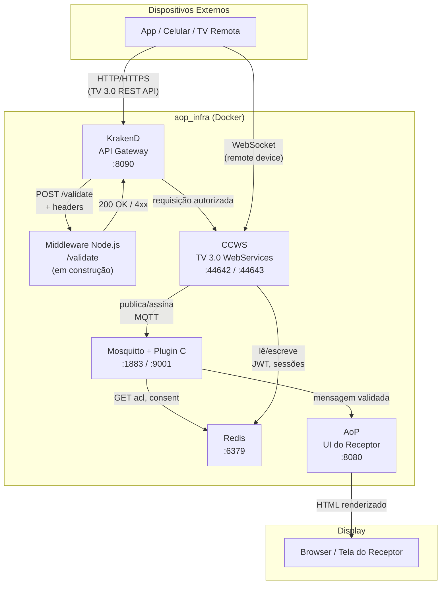
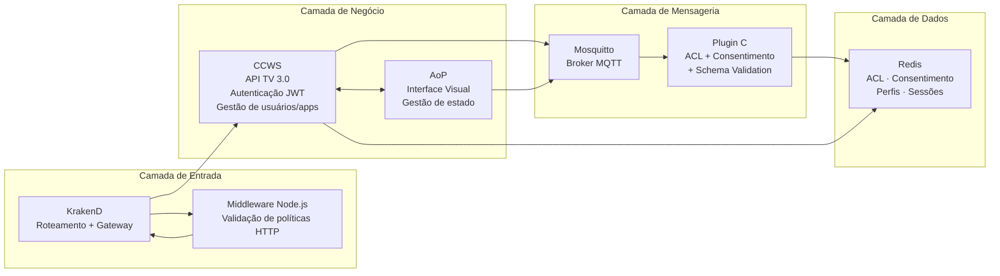

# Visão Geral do Sistema

Fluxo completo de uma interação no receptor TV 3.0, do dispositivo externo ao display.

```mermaid
graph TD
    subgraph Externos["Dispositivos Externos"]
        APP["App / Celular / TV Remota"]
    end

    subgraph Infra["aop_infra (Docker)"]
        KD["KrakenD\nAPI Gateway\n:8090"]
        MW["Middleware Node.js\n/validate\n(em construção)"]
        CCWS["CCWS\nTV 3.0 WebServices\n:44642 / :44643"]
        MQ["Mosquitto + Plugin C\n:1883 / :9001"]
        REDIS["Redis\n:6379"]
        AOP["AoP\nUI do Receptor\n:8080"]
    end

    subgraph Display["Display"]
        BROWSER["Browser / Tela do Receptor"]
    end

    APP -->|"HTTP/HTTPS\n(TV 3.0 REST API)"| KD
    KD -->|"POST /validate\n+ headers"| MW
    MW -->|"200 OK / 4xx"| KD
    KD -->|"requisição autorizada"| CCWS

    CCWS -->|"publica/assina\nMQTT"| MQ
    MQ -->|"GET acl, consent"| REDIS
    MQ -->|"mensagem validada"| AOP

    CCWS -->|"lê/escreve\nJWT, sessões"| REDIS

    AOP -->|"HTML renderizado"| BROWSER
    APP -->|"WebSocket\n(remote device)"| CCWS
```

---

## Responsabilidades por camada

```mermaid
graph LR
    subgraph "Camada de Entrada"
        KD["KrakenD\nRoteamento + Gateway"]
        MW["Middleware Node.js\nValidação de políticas HTTP"]
    end

    subgraph "Camada de Negócio"
        CCWS["CCWS\nAPI TV 3.0\nAutenticação JWT\nGestão de usuários/apps"]
        AOP["AoP\nInterface Visual\nGestão de estado"]
    end

    subgraph "Camada de Mensageria"
        MQ["Mosquitto\nBroker MQTT"]
        PLUGIN["Plugin C\nACL + Consentimento\n+ Schema Validation"]
    end

    subgraph "Camada de Dados"
        REDIS["Redis\nACL · Consentimento\nPerfis · Sessões"]
    end

    KD --> MW
    MW --> KD
    KD --> CCWS
    CCWS <--> AOP
    CCWS --> MQ
    AOP --> MQ
    MQ --> PLUGIN
    PLUGIN --> REDIS
    CCWS --> REDIS
```
