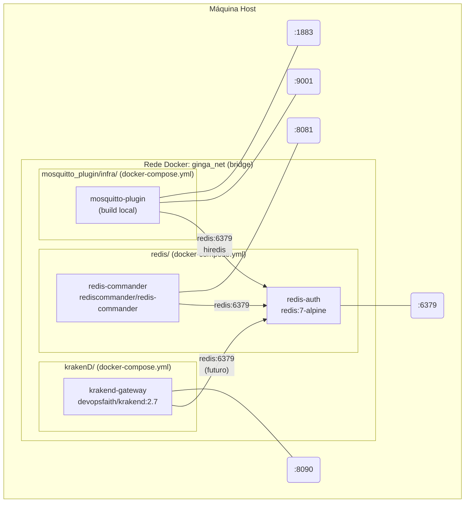
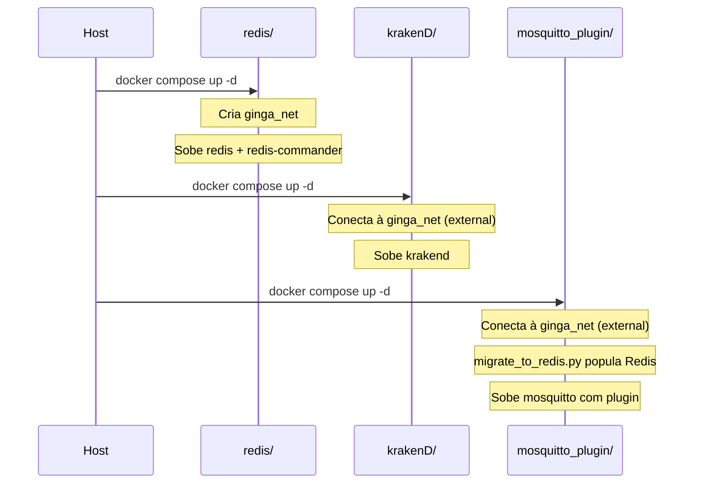

# Rede Docker

Containers, portas expostas e comunicação interna via `ginga_net`.

```mermaid
graph TB
    subgraph HOST["Máquina Host"]

        subgraph ginga_net["Rede Docker: ginga_net (bridge)"]

            subgraph redis_svc["redis/ (docker-compose.yml)"]
                REDIS["redis-auth\nredis:7-alpine"]
                REDISCMD["redis-commander\nrediscommander/redis-commander"]
            end

            subgraph krakend_svc["krakenD/ (docker-compose.yml)"]
                KD["krakend-gateway\ndevopsfaith/krakend:2.7"]
            end

            subgraph mosquitto_svc["mosquitto_plugin/infra/ (docker-compose.yml)"]
                MQ["mosquitto-plugin\n(build local)"]
            end
        end

        P6379(":6379")
        P8081(":8081")
        P8090(":8090")
        P1883(":1883")
        P9001(":9001")
    end

    REDIS --- P6379
    REDISCMD --- P8081
    KD --- P8090
    MQ --- P1883
    MQ --- P9001

    REDISCMD -->|"redis:6379"| REDIS
    KD -->|"redis:6379\n(futuro)"| REDIS
    MQ -->|"redis:6379\nhiredis"| REDIS
```

---

## Ordem de criação e dependência de rede

```mermaid
sequenceDiagram
    participant HOST as Host
    participant REDIS as redis/
    participant KD as krakenD/
    participant MQ as mosquitto_plugin/

    HOST->>REDIS: docker compose up -d
    Note over REDIS: Cria ginga_net
    Note over REDIS: Sobe redis + redis-commander

    HOST->>KD: docker compose up -d
    Note over KD: Conecta à ginga_net (external)
    Note over KD: Sobe krakend

    HOST->>MQ: docker compose up -d
    Note over MQ: Conecta à ginga_net (external)
    Note over MQ: migrate_to_redis.py popula Redis
    Note over MQ: Sobe mosquitto com plugin
```
