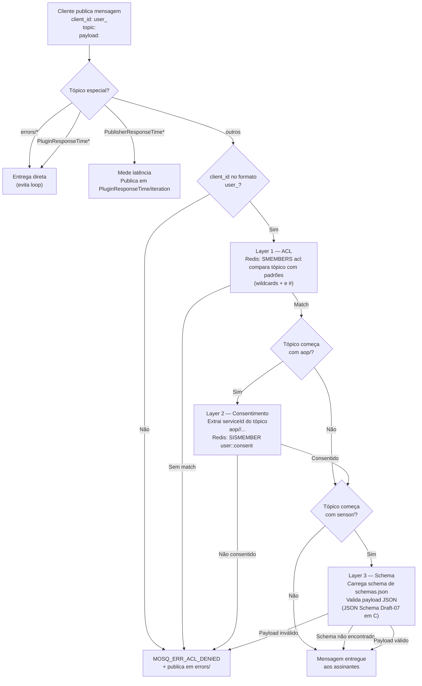
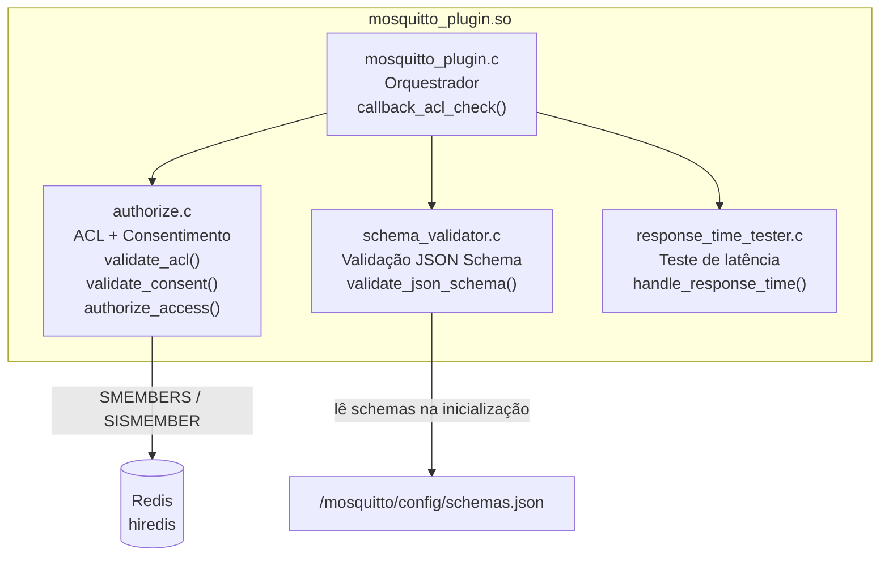
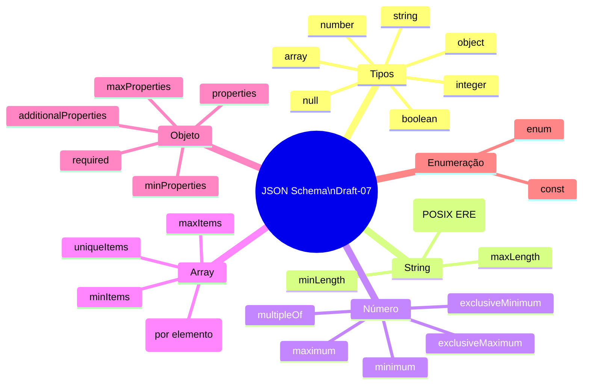
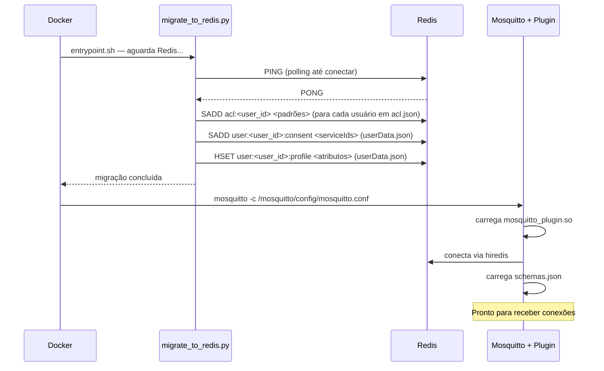

# Pipeline de Segurança MQTT

O plugin C intercepta toda mensagem publicada no broker antes de entregá-la aos assinantes.

## Fluxo de validação por mensagem

---

## Estrutura do Plugin C

---

## Validações de Schema suportadas

---

## Inicialização do container Mosquitto

