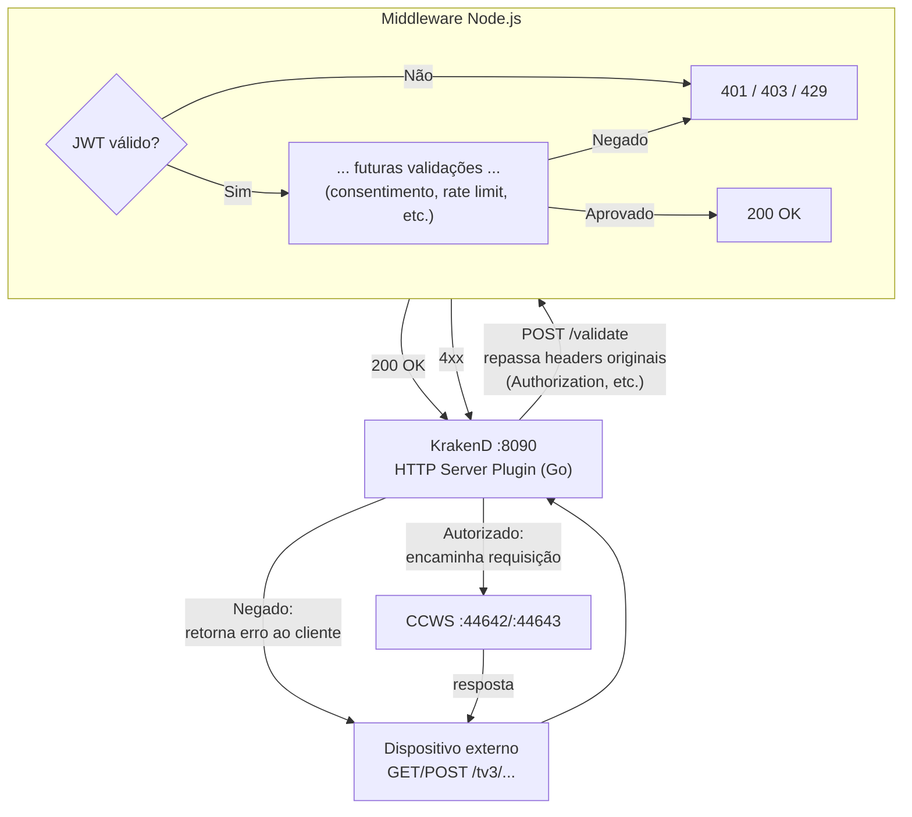
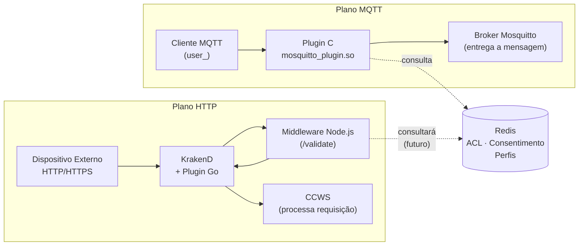
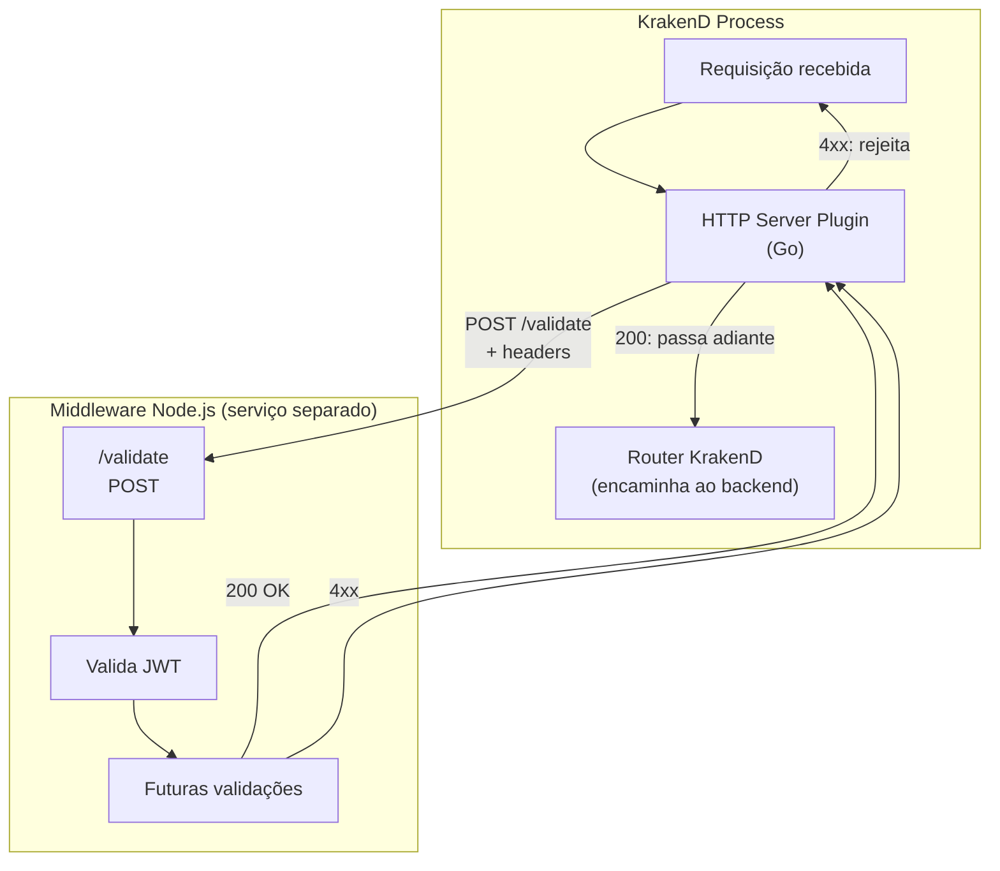
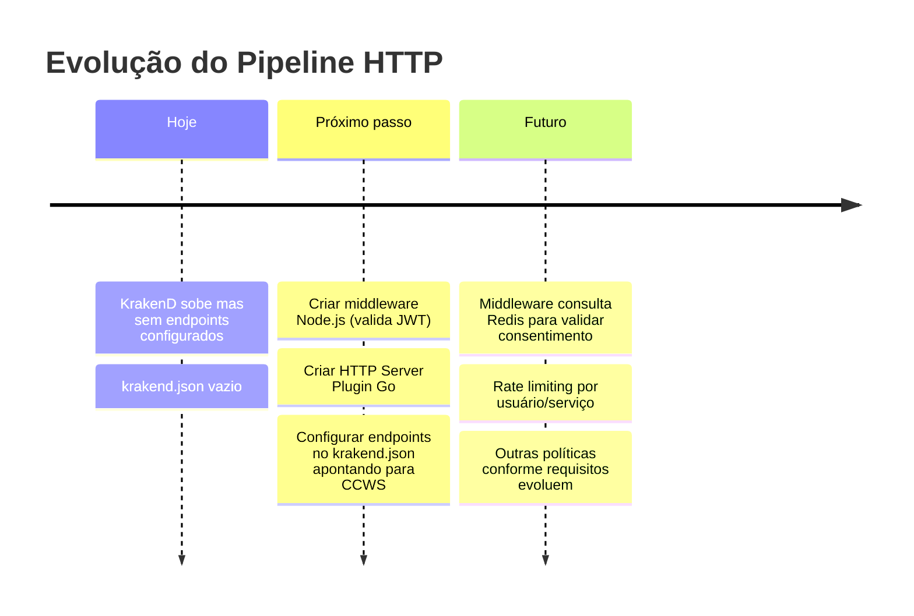

# Pipeline de Segurança HTTP

O KrakenD atua como API Gateway na frente do CCWS, delegando a validação de políticas
a um middleware Node.js externo. Essa arquitetura espelha no plano HTTP o que o
plugin C faz no plano MQTT.

## Fluxo de validação por requisição



---

## Simetria com o plugin MQTT



---

## Estrutura do HTTP Server Plugin (Go)



---

## Configuração KrakenD (modelo a implementar)

```json
{
  "$schema": "https://www.krakend.io/schema/v2.7/krakend.json",
  "version": 3,
  "name": "GingaDistrib API Gateway",
  "port": 8080,
  "extra_config": {
    "plugin/http-server": {
      "name": ["consent-validator"],
      "consent-validator": {
        "middleware_url": "http://middleware-node:3000"
      }
    }
  },
  "endpoints": [
    {
      "endpoint": "/tv3/{path}",
      "backend": [
        { "url_pattern": "/tv3/{path}", "host": ["http://ccws:44642"] }
      ]
    }
  ]
}
```

---

## Estado atual vs. planejado


