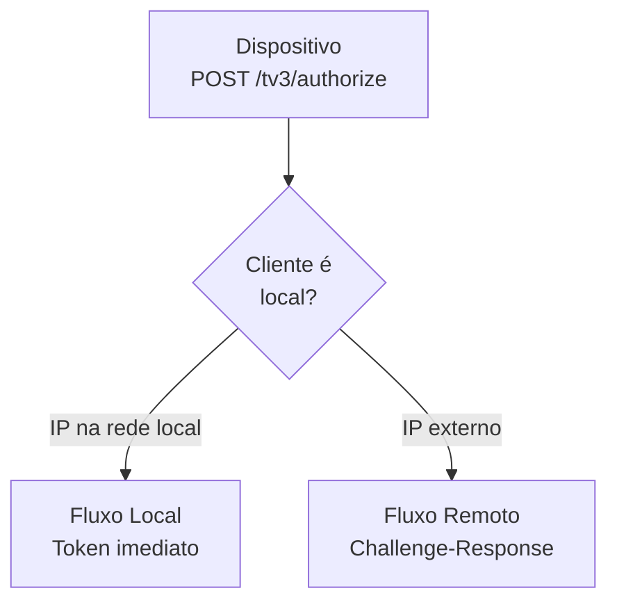
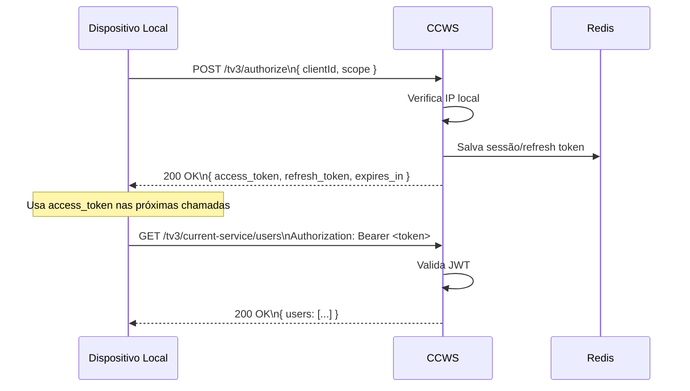
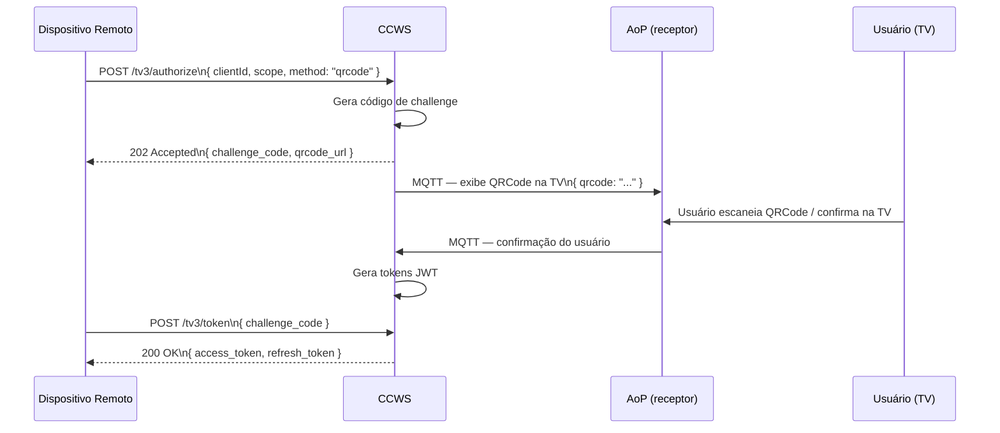
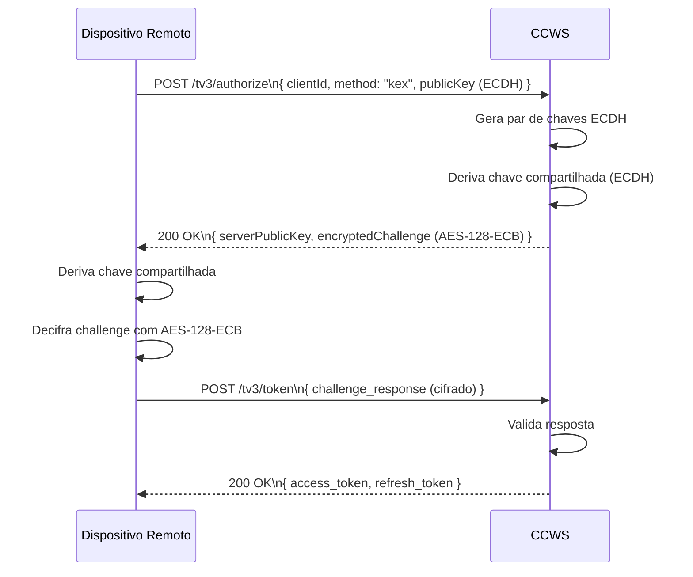
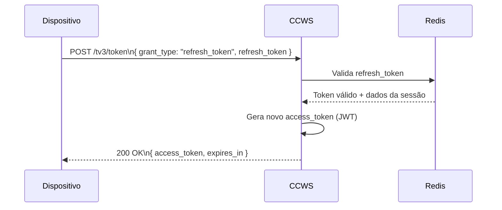
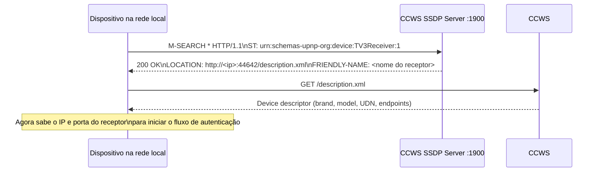

# Fluxos de Autenticação TV 3.0

O CCWS implementa o protocolo de autenticação TV 3.0 com dois fluxos distintos
dependendo de onde o cliente está: na rede local ou em rede remota.

## Decisão do fluxo

---

## Fluxo Local (cliente na mesma rede)

---

## Fluxo Remoto — QRCode (cliente fora da rede)

---

## Fluxo Remoto — KEX / ECDH (troca de chaves)

---

## Renovação de token

---

## Descoberta SSDP

Antes de autenticar, dispositivos na rede local descobrem o receptor via SSDP (UPnP):

