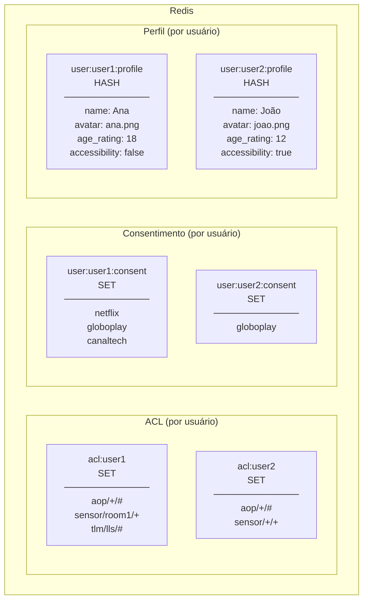
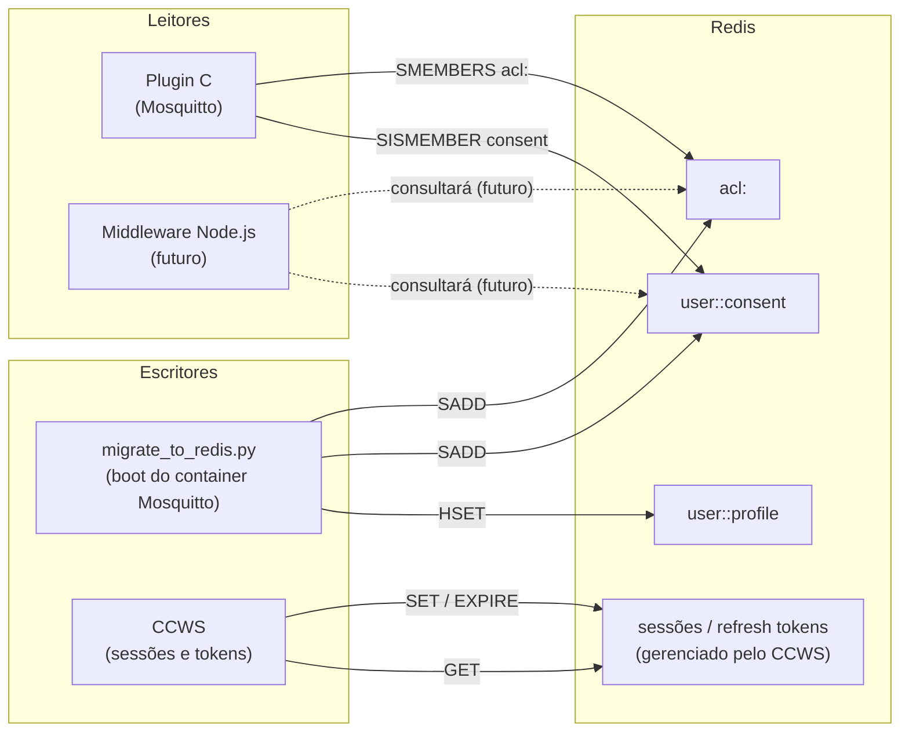
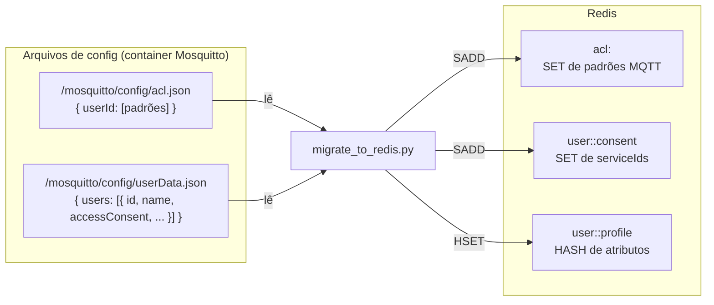

# Modelo de Dados — Redis

O Redis é o repositório compartilhado de estado de segurança do sistema.
Todos os serviços que precisam de ACL, consentimento ou dados de usuário consultam aqui.

## Visão geral das chaves



---

## Quem lê e quem escreve



---

## Origem dos dados: JSONs → Redis



---

## Comandos Redis usados pelo Plugin C

| Operação | Comando Redis | Chave | Descrição |
|---|---|---|---|
| Listar ACL do usuário | `SMEMBERS` | `acl:<user_id>` | Retorna todos os padrões de tópico permitidos |
| Verificar consentimento | `SISMEMBER` | `user:<user_id>:consent` | Checa se serviceId está no set do usuário |

---

## Exemplo de dados populados

```
# ACL do usuário "alice"
acl:alice → { "aop/+/#", "sensor/sala/+", "tlm/lls/#" }

# Consentimento da usuária "alice"
user:alice:consent → { "netflix", "globoplay" }

# Perfil da usuária "alice"
user:alice:profile → {
    name: "Alice",
    avatar: "alice.png",
    age_rating: "18",
    accessibility: "false",
    language: "pt-BR"
}
```

---

## Validação de acesso — exemplos

| Usuário | Tópico | ACL? | Consentimento? | Resultado |
|---|---|---|---|---|
| alice | `aop/netflix/currentApp` | ✅ `aop/+/#` | ✅ netflix | **Permitido** |
| alice | `aop/hbomax/currentApp` | ✅ `aop/+/#` | ❌ hbomax não consentido | **Negado** |
| alice | `sensor/sala/temperature` | ✅ `sensor/sala/+` | N/A | **Permitido** |
| alice | `sensor/quarto/temperature` | ❌ sem padrão | N/A | **Negado** |
| bob | `aop/netflix/currentApp` | ❌ sem ACL | N/A | **Negado** |
